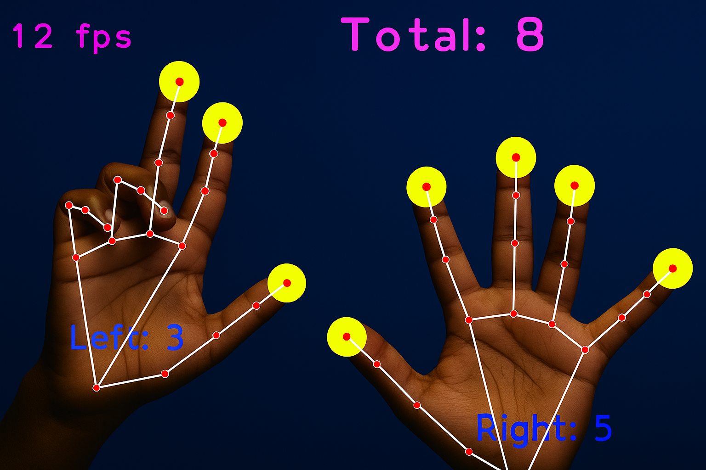

# Hand Gesture Finger Counter


A simple Python project that uses OpenCV and MediaPipe to detect hands via webcam and count the number of fingers raised.

## Features

- Real-time hand tracking using webcam
- Detects both left and right hands
- Counts how many fingers are raised per hand
- Displays total finger count and FPS

## Requirements

- Python 3.x
- OpenCV
- MediaPipe

Install dependencies with:

```bash
pip install opencv-python mediapipe
